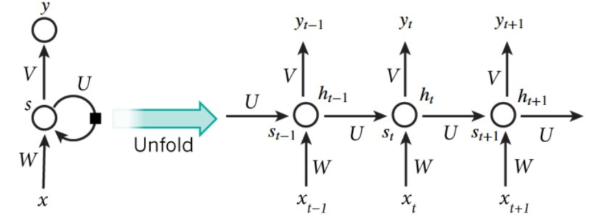
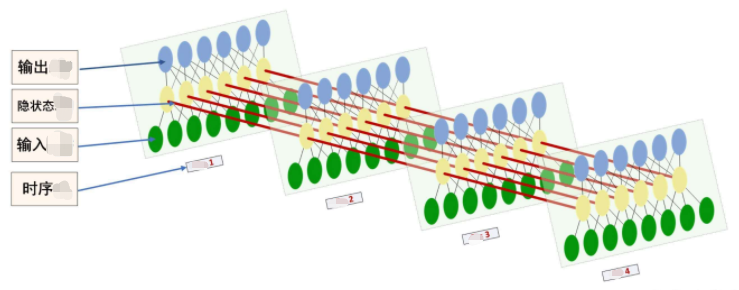
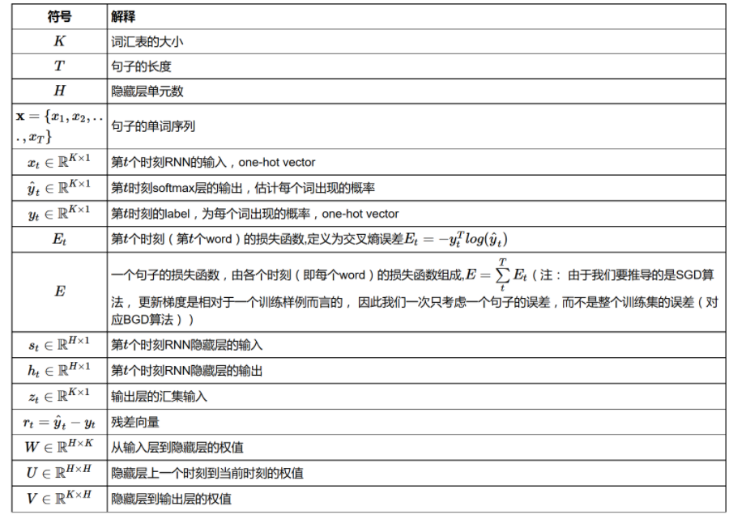

### 常用的几个激活函数

### RNN结构图
- RNN结构图-抽象
    
- RNN结构图-具体
    
### 符号说明

## 附录
### 常用激活函数及其到导数
- sigmoid

    
- relu

    
- tanh

    

## 参考资料
- [1] [Recurrent Neural Networks Tutorial, Part 3 – Backpropagation Through Time and Vanishing Gradients
](http://www.wildml.com/2015/10/recurrent-neural-networks-tutorial-part-3-backpropagation-through-time-and-vanishing-gradients/)

